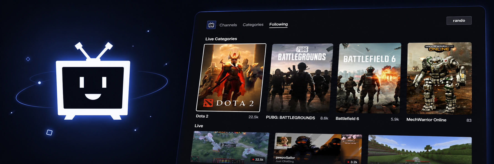

<p align="center">
  
</p>

<h1 align="center">Twoku Black (A <a href="https://github.com/worldreboot/twitch-reloaded-roku">Twoku</a> fork)</h1>
<p align="center">
  <b>Live streams, chat, and past broadcasts on Roku.</b><br />
  Browse Twitch from the couch with an interface built for your TV remote.
</p>
<p align="center">
  <a href="https://github.com/nkatchik/twoku-black/actions/workflows/tests.yml"></a>
  
  
</p>
<p align="center">
  <a href="#install-on-your-roku">Install</a> ·
  <a href="#sign-in">Sign in</a> ·
  <a href="#remote-controls">Controls</a> ·
  <a href="#compatibility">Compatibility</a> ·
  <a href="#contributing">Contribute</a>
</p>

<p align="center">
  Twoku Black is an unofficial community project.<br />
  <strong>Not affiliated with Twitch, Amazon, or Roku.</strong>
</p>

## What you can do

- **Find something to watch.** Browse live channels and games by viewer count, or search for a channel or category.
- **Keep up with your favorites.** Sign in to see followed channels, with live streams and offline profiles in one scrolling view.
- **Explore a channel.** Open its profile for follower counts, the current live stream, and past broadcasts.
- **Catch up later.** Watch recordings and recent category clips, with pause, seeking, and quality selection.
- **Follow the conversation.** Show or hide live chat beside the video. Your chat preference is remembered.
- **Choose your quality.** Use Auto or select any available video quality, including 60 fps when offered. Switching quality keeps your place in recordings.

## Install on your Roku

Keep your computer and Roku on the same network.

1. Follow to [enable developer mode](https://developer.roku.com/dev/docs/developer-setup).
2. [⬇ Download the latest ZIP](https://github.com/nkatchik/twoku-black/releases/latest/download/twoku.zip).
3. Open your Roku's IP address in a browser. Sign in as `rokudev` with your developer-mode password.
4. Click **Upload**, select the ZIP, then **Install with zip** or **Replace with zip**.

## Remote controls

| Button | Browsing | Playback |
| --- | --- | --- |
| **D-pad** | Move between cards and tabs; **Up** from the first row reaches the header. | Reveal and navigate controls. On recordings, **Left / Right** seeks when the progress bar is selected or controls are hidden. |
| **OK** | Open the selected item. | Activate a control; pause or resume a recording when the progress bar is selected. |
| **Options (`*`)** | Open the selected channel's profile where available. | Open the quality menu. |
| **Reload (circular arrow)** | Refresh the current grid or profile. | Reload the video and visible chat. Recordings and clips keep their position. |
| **Play / Pause** | — | Pause or resume a recording or clip. |
| **Rewind / Fast-forward** | — | Seek backward or forward in 10-second steps. |
| **Back** | Return to the previous view. | Dismiss the quality menu, controls, or chat, then return to browsing. During loading or an error, return immediately. |
| **Home** | Return to Roku Home. | Return to Roku Home. |

The player also has **Channel**, **Chat** for live streams, and **Quality** controls. In the quality menu, use **Up / Down** to choose and **OK** to apply.

## Compatibility

This fork is under active development. Device support depends on Roku firmware, the native video decoder, and the stream format Twitch delivers.

| Device | Current coverage |
| --- | --- |
| **Roxton / K806X, Roku OS 15.3.4** | Device checks cover browsing, sign-in, Following, live playback, recordings, chat, quality switching, and remote navigation. |
| **Other Roku players and Roku TVs** | Not yet verified by this fork. Reports from additional models are welcome. |

**Auto quality** prefers the device's reported resolution and frame-rate capabilities, prioritizing resolution. It can step down after playback failures, prolonged buffering, or stalls; direct playback also uses download timing to detect insufficient bandwidth. It does not currently step back up automatically. Manual selection stays fixed, and capability checks never remove available video qualities from the menu.

Some Twitch streams need an experimental compatibility path that separates audio and video delivery on the Roku. It preserves the encoded media without transcoding and requires no separate server to install. Playback and sustained performance can still vary by device; see the [playback compatibility notes](docs/playback-compatibility.md) for tested formats and remaining limitations.

**Not currently supported:** subscriber-only recordings, replay chat for recordings, and sending chat messages.

## Contributing

Bug reports, device tests, and focused pull requests are welcome. For playback or compatibility reports, include your Roku model and OS version, the channel or recording, selected quality, steps to reproduce, and whether **Back** and **Home** still respond. Remove tokens and signed playback URLs from logs before sharing them.

The app uses BrightScript and SceneGraph; no transpilation is needed to create the sideload ZIP. To run the regression suites, install Node.js and Python 3, then run these commands from the repository:

```sh
npm install --prefix /tmp/twoku-validation --no-audit --no-fund brs@0.45.0
python3 tests/run.py --brs /tmp/twoku-validation/node_modules/.bin/brs
python3 tests/release.py
```

See the [testing guide](tests/README.md) for additional tooling, known compiler diagnostics, and device acceptance checks. The off-device suites exercise app logic; rendering, remote timing, and native playback also need testing on a Roku.

## Credits

This fork continues the work of the [original Twoku project](https://github.com/worldreboot/twitch-reloaded-roku) and its contributors. Third-party notices are kept alongside their bundled components and assets.
